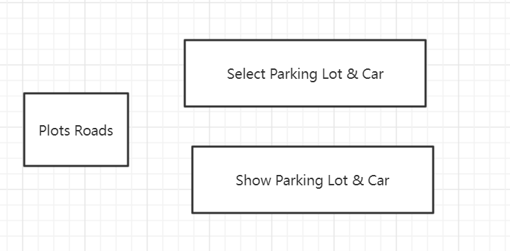
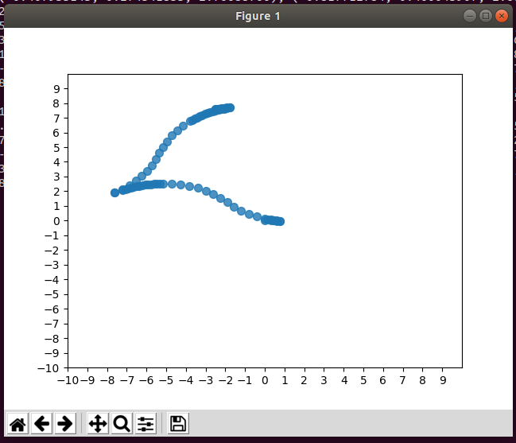
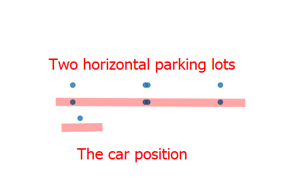

# Parking Lots Select Tool
## Background 

Since we want to get the parking lots and the corresponding obstacle locations in the XY axies easily and then build our planning test cases using these locations(Either parking lots or obstacles). We need a tool to choose locations on the coordinate system.

## Artitecture

This project is consist of three sub modules, plot roads, select parking lots and car and show parking lots and car.
The whole picture is as belows,



- Plot Roads: The plot roads module is used to plot the corresponding roads using a given route in json format.

- Select parking lots and car: This module is used to select parking lots, car, pillar, cone and uss mods.

- Show parking lots and car: This module is used to show a parking lot's geometry location on the canvas. You can use the below web site instead, it's more useful and efficiency.
  
  https://www.desmos.com/calculator


## Prerequisites

To make use of this project, you need to install python and matplotlib first.

For how to install python on your machine, pls refer to Google or Bing for a tutorial.

After python is installed, you can use the below command to have matplotlib installed,

```shell
pip install matplotlib
```

## Usage

### Plot Roads

After get  track info from  the corresponding topic "TrajectoryFully", you can paste your track info in json format to the plot_roads py, then run the file as belows, it will show you the corresponding track info.

Command to run,
```shell
python plot_roads.py
```

The corresponding roads info will be shown as belows,


The program will also print the corresponding track info in python list format, you can send the list track info to developer for a further diagnostic.

### Sekect Parking lots and Car
This program is the main part of the Parking lot selection tool.
You can start the program as belows,
```shell
python select_plots_and_car.py h 2
```

The third param can be one of "h", "v", "a",  h stands for horizontal parking lots, v stands for vertical parking lots and a stands for angle parking lots.

The fourth param can be a number like 2, 3 ,4, 5, this param indicate how many parking lots it will create when you click on the form. The default value is 3 which means that it will create 3 parking lots once you click on the form. The other thing need to be mentioned here is that once you try to click on the form, the program will clear all the parking lots,mods on the screen and start a new session.

Once the program has been launched, you can start to work on selecting parking lots and mods. Below are what kinds of operations is supported by the program.

1. Single click on the screen, it will generate several parking lots on the position you have clicked as belows,




2. Select USS obstacle on the screen,
 
 Select a position on the screen, then click a number key on the keyboard,
 - '2' stands for lines
 - '3' stands for triangles
 - '4' stands for rectangles
 - '5' stands for pentagon

 Below is how we can select a rectangle on the screen,


All of the parking lots and mods you have selected on the screen will be printed to console. You can copy the coordinates of them and then paste to your test cases.

See the below picture for more details,


### Show Parking lots and Car

Show parking lots and car is a program used to show parking lots on the screen, you can just paste your parking lots in the py file and run it as belows, it will show you where the parking lots locate at.

The program's behavior is as belows,


You can also use the below web sites to achieve this, it's more easy and efficiency.

 https://www.desmos.com/calculator
